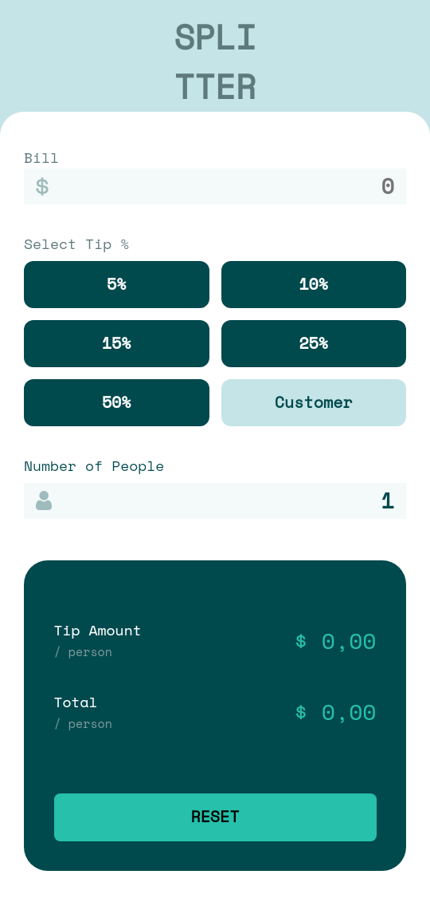
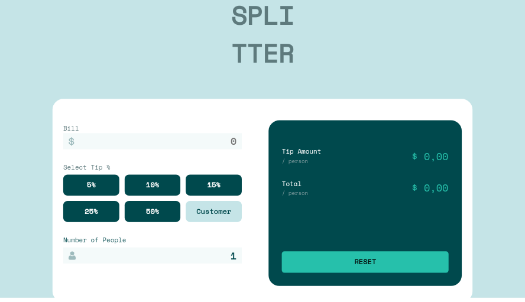

# Frontend Mentor - Tip calculator app solution

This is a solution to the [Tip calculator app challenge on Frontend Mentor](https://www.frontendmentor.io/challenges/tip-calculator-app-ugJNGbJUX). Frontend Mentor challenges help you improve your coding skills by building realistic projects.

## Table of contents

- [Overview](#overview)
  - [The challenge](#the-challenge)
  - [Screenshot](#screenshot)
  - [Links](#links)
- [My process](#my-process)
  - [Built with](#built-with)
  - [What I learned](#what-i-learned)
- [Author](#author)

## Overview

### The challenge

Users should be able to:

- View the optimal layout for the app depending on their device's screen size
- See hover states for all interactive elements on the page
- Calculate the correct tip and total cost of the bill per person

### Screenshot

- Mobile Screenshot



- Desktop Screenshot



### Links

- GitHub: [GitHub](https://github.com/IagoBomfim/tip-calculator-app)
- Live Site URL: [tip calculator](https://tiny-basbousa-cf8475.netlify.app/)

## My process

### Built with

- Semantic HTML5 markup
- CSS custom properties
- Flexbox
- CSS Grid
- Mobile-first workflow{}

### What I learned

Using display grid and media query and variables in css, with the help of the display grid I was able to organize the buttons of the elements as in the designer

```css
.percentage-container {
  display: grid;
    grid-template-columns: 1fr 1fr 1fr;
    grid-template-rows: 1fr 1fr;
    gap: 10px;
    
    width: 100%;
}
```

Using global CSS variables for better color-coding maintenance in the future, and global selectors to strip html elements by default.

```css
@import url('https://fonts.googleapis.com/css2?family=Space+Mono:ital,wght@0,400;1,700&display=swap');

:root {
  /*PRIMARY COLOR*/
  --primary-Strong-cyan: hsl(172, 67%, 45%);

  /*NEUTRAL COLOR*/
  --neutral-Very-dark-cyan: hsl(183, 100%, 15%);
  --neutral-Dark-grayish-cyan: hsl(186, 14%, 43%);
  --neutral-Grayish-cyan: hsl(184, 14%, 56%);
  --neutral-Light-grayish-cyan: hsl(185, 41%, 84%);
  --neutral-Very-light-grayish-cyan: hsl(189, 41%, 97%);
  --neutral-White: hsl(0, 0%, 100%);
}

* {
  margin: 0;
  padding: 0;
  box-sizing: border-box;
  font-family: 'Space Mono', monospace;
  font-weight: 400;
};
```

Using media query selectors for better adaptation of content on mobile devices

```css
@media only screen and (max-width: 360px) {
  .calculator-container {
    width: 100%;
    flex-direction: column;
  }
  
  .title {
    margin-top: 200px;
    margin-bottom: 0px;
    font-size: 28px;
  }
  
  .left-container {
    margin-right: 0px;
  }
  
  .percentage-container {
    grid-template-columns: 1fr 1fr;
  }
  
  #button-reset {
    margin-top: 50px;
  }
};
```

## Author

- GitHub - [GitHub](https://github.com/IagoBomfim)
- Frontend Mentor - [@IagoBomfim](https://www.frontendmentor.io/profile/IagoBomfim)